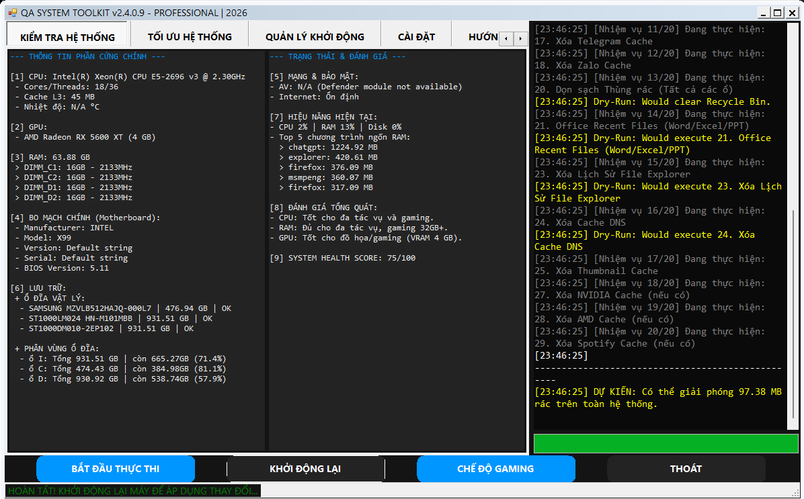

<p align="center">

</p>

<p align="center">

</p>

<h1 align="center">🛠 QA Toolkit</h1>

<p align="center">
<b>Windows System Optimization Tool</b><br>
PowerShell + GUI
</p>

<p align="center">


</p>

---

# 🚀 Overview

**QA Toolkit** là công cụ tối ưu hóa và kiểm tra hệ thống **Windows** được xây dựng bằng **PowerShell** với giao diện GUI thân thiện.

Công cụ giúp người dùng nhanh chóng:

- Kiểm tra tình trạng hệ thống
- Dọn dẹp file rác Windows
- Quản lý chương trình khởi động
- Phân tích hiệu năng máy tính
- Xuất báo cáo hệ thống

QA Toolkit được thiết kế nhằm giúp **máy tính chạy nhanh hơn, sạch hơn và ổn định hơn chỉ trong vài phút**.

---

# ✨ Features

### 🔍 System Audit
Kiểm tra toàn diện hệ thống:

- CPU
- RAM
- Disk
- Windows version
- Startup programs

---

### 🧹 Temp Cleanup
Dọn dẹp file rác và dữ liệu tạm:

- Windows temp
- Cache hệ thống
- File rác
- Update leftovers

---

### ⚡ Startup Manager
Quản lý chương trình khởi động cùng Windows:

- Xem danh sách startup
- Tắt ứng dụng không cần thiết
- Tăng tốc khởi động Windows

---

### 📊 System Health Score
Đánh giá sức khỏe hệ thống theo thang điểm **0 – 100** dựa trên:

- dung lượng ổ đĩa
- số lượng startup
- temp files
- trạng thái hệ thống

---

### 📄 HTML Report
Xuất báo cáo hệ thống dạng **HTML chuyên nghiệp** bao gồm:

- thông tin hệ thống
- tình trạng ổ đĩa
- startup programs
- health score

---

### 🔒 Safe Cleanup Mode
Chế độ dọn dẹp an toàn giúp tránh xóa nhầm các file quan trọng của hệ thống.

---

# 🖥 Program Interface

<p align="center">

</p>

---

# 📦 Download

<p align="center">

[](https://github.com/PQC-hub/QA-Toolkit/releases)

</p>

Download phiên bản mới nhất tại:

https://github.com/PQC-hub/QA-Toolkit/releases

| File | Description |
|-----|-------------|
| QA-Toolkit.exe | Bản chạy trực tiếp |
| QA-Toolkit.zip | Source code |
| QA-Toolkit.ps1 | Script PowerShell |

---

# ⚙️ System Requirements

| Requirement | Minimum |
|---|---|
Operating System | Windows 10 / Windows 11 |
PowerShell | 5.1 hoặc cao hơn |
Permissions | Administrator (cho một số tính năng nâng cao) |

---

# 🛠 Installation

## Method 1 — Download Release

1. Tải file từ trang **Releases**
2. Giải nén nếu là file `.zip`
3. Chạy chương trình

---

## Method 2 — Run via PowerShell

Clone repository:

```powershell
git clone https://github.com/PQC-hub/QA-Toolkit.git
```

Run script:

```powershell
cd QA-Toolkit
powershell -ExecutionPolicy Bypass -File QA-Toolkit.ps1
```

---

# 📂 Project Structure

```
QA-Toolkit
│
├ banner.png
├ logo_QA.ico
├ manhinh.png
│
├ QA-Toolkit.ps1
├ README.md
└ docs
```

---

# 🧠 Roadmap

Planned features:

- Registry cleanup
- Driver checker
- Disk benchmark
- Windows service analyzer
- Portable version

---

# 🤝 Contributing

Contributions are welcome.

You can:

- report bugs
- suggest new features
- submit pull requests

---

# ⭐ Support the Project

Nếu bạn thấy dự án hữu ích:

⭐ Star repository  
🐛 Report bugs  
💡 Suggest features  

---

# 📜 License

MIT License
